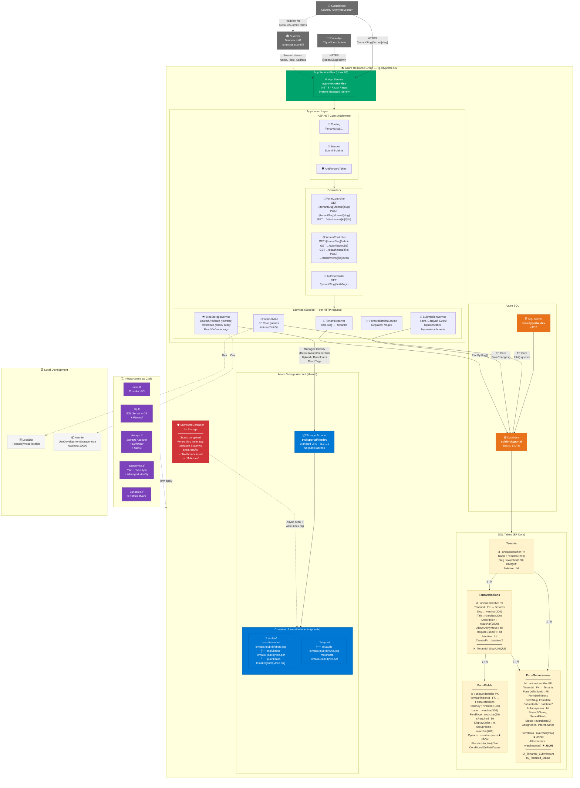

```mermaid
%%─────────────────────────────────────────────────────────────────────────────
%%  CityPortal Demo — Full Architecture
%%─────────────────────────────────────────────────────────────────────────────

graph TB

    %% ═══════════════════════════════════════════════════════════════════════
    %%  USERS & EXTERNAL IDENTITY
    %% ═══════════════════════════════════════════════════════════════════════

    citizen["👤 Kuntalainen<br/><i>Citizen / Anonymous user</i>"]
    officer["👩‍💼 Virkailija<br/><i>City officer / Admin</i>"]
    suomifi["🏛️ Suomi.fi<br/><i>National e-ID</i><br/>tunnistus.suomi.fi"]

    citizen -->|"HTTPS<br/>/{tenantSlug}/forms/{slug}"| appservice
    officer -->|"HTTPS<br/>/{tenantSlug}/admin"| appservice
    citizen -.->|"Redirect for<br/>RequireSuomiFi forms"| suomifi
    suomifi -.->|"Session claims:<br/>Name, Hetu, Address"| appservice

    %% ═══════════════════════════════════════════════════════════════════════
    %%  AZURE RESOURCE GROUP  (rg-cityportal-dev)
    %% ═══════════════════════════════════════════════════════════════════════

    subgraph rg["☁️ Azure Resource Group — rg-cityportal-dev"]
        direction TB

        %% ─── App Service ────────────────────────────────────────────────
        subgraph appservice_group["App Service Plan (Linux B1)"]
            appservice["🌐 App Service<br/><b>app-cityportal-dev</b><br/>.NET 8 · Razor Pages<br/>System Managed Identity"]
        end

        %% ─── Application internals ─────────────────────────────────────
        subgraph app_internals["Application Layer"]
            direction TB

            subgraph controllers["Controllers"]
                formctrl["📝 FormController<br/>GET /{tenantSlug}/forms/{slug}<br/>POST /{tenantSlug}/forms/{slug}<br/>GET .../attachment/{id}/{file}"]
                adminctrl["📋 AdminController<br/>GET /{tenantSlug}/admin<br/>GET .../submission/{id}<br/>GET .../attachment/{file}<br/>POST .../attachment/{file}/scan"]
                authctrl["🔐 AuthController<br/>GET /{tenantSlug}/auth/login"]
            end

            subgraph services["Services (Scoped — per HTTP request)"]
                resolver["🏢 TenantResolver<br/><i>URL slug → TenantId</i>"]
                formsvc["📄 FormService<br/><i>EF Core queries<br/>Include(Fields)</i>"]
                subsvc["💾 SubmissionService<br/><i>Save, GetById, GetAll<br/>UpdateStatus, UpdateAttachments</i>"]
                validator["✅ FormValidationService<br/><i>Required, Regex</i>"]
                blobsvc["☁️ BlobStorageService<br/><i>Upload (validate type/size)<br/>Download (check scan)<br/>Read Defender tags</i>"]
            end

            subgraph middleware["ASP.NET Core Middleware"]
                routing["🔀 Routing<br/>/{tenantSlug}/..."]
                session["🍪 Session<br/>Suomi.fi claims"]
                antiforgery["🛡️ AntiForgeryToken"]
            end

            controllers --> services
            middleware --> controllers
        end

        appservice --> app_internals

        %% ─── Azure SQL ─────────────────────────────────────────────────
        subgraph sql_group["Azure SQL"]
            direction TB
            sqlserver["🗄️ SQL Server<br/><b>sql-cityportal-dev</b><br/>v12.0"]
            sqldb["💿 Database<br/><b>sqldb-cityportal</b><br/>Basic / 5 DTU"]
            sqlserver --> sqldb
        end

        subgraph sql_tables["SQL Tables (EF Core)"]
            direction TB
            t_tenants["<b>Tenants</b><br/>─────────────<br/>Id : uniqueidentifier PK<br/>Name : nvarchar(200)<br/>Slug : nvarchar(100) UNIQUE<br/>IsActive : bit"]
            t_formdefs["<b>FormDefinitions</b><br/>─────────────<br/>Id : uniqueidentifier PK<br/>TenantId : FK → Tenants<br/>Slug : nvarchar(200)<br/>Title : nvarchar(300)<br/>Description : nvarchar(2000)<br/>AllowAnonymous : bit<br/>RequireSuomiFi : bit<br/>IsActive : bit<br/>CreatedAt : datetime2<br/>─────────────<br/>IX_TenantId_Slug UNIQUE"]
            t_formfields["<b>FormFields</b><br/>─────────────<br/>Id : uniqueidentifier PK<br/>FormDefinitionId : FK → FormDefinitions<br/>FieldKey : nvarchar(100)<br/>Label : nvarchar(300)<br/>FieldType : nvarchar(50)<br/>IsRequired : bit<br/>DisplayOrder : int<br/>GroupName : nvarchar(200)<br/>Options : nvarchar(max) <b>★ JSON</b><br/>Placeholder, HelpText<br/>ConditionalOnField/Value"]
            t_submissions["<b>FormSubmissions</b><br/>─────────────<br/>Id : uniqueidentifier PK<br/>TenantId : FK → Tenants<br/>FormDefinitionId : FK → FormDefinitions<br/>FormSlug, FormTitle<br/>SubmittedAt : datetime2<br/>IsAnonymous : bit<br/>SuomiFiName, SuomiFiHetu<br/>Status : nvarchar(50)<br/>AssignedTo, InternalNotes<br/>─────────────<br/>FormData : nvarchar(max) <b>★ JSON</b><br/>Attachments : nvarchar(max) <b>★ JSON</b><br/>─────────────<br/>IX_TenantId_SubmittedAt<br/>IX_TenantId_Status"]

            t_tenants -->|"1 : N"| t_formdefs
            t_formdefs -->|"1 : N"| t_formfields
            t_tenants -->|"1 : N"| t_submissions
            t_formdefs -->|"1 : N"| t_submissions
        end

        sqldb --> sql_tables

        %% ─── Azure Storage ─────────────────────────────────────────────
        subgraph storage_group["Azure Storage Account (shared)"]
            direction TB
            storageacct["📦 Storage Account<br/><b>stcityportalfilesdev</b><br/>Standard LRS · TLS 1.2<br/>No public access"]

            subgraph container["Container: form-attachments (private)"]
                direction TB
                blob_vantaa["📁 vantaa/<br/>├── tievaurio-lomake/{subId}/photo.jpg<br/>├── meluhaitta-lomake/{subId}/doc.pdf<br/>└── puunkaato-lomake/{subId}/tree.png"]
                blob_espoo["📁 espoo/<br/>├── tievaurio-lomake/{subId}/kuva.jpg<br/>└── meluhaitta-lomake/{subId}/file.pdf"]
            end

            storageacct --> container
        end

        %% ─── Microsoft Defender ─────────────────────────────────────────
        defender["🛡️ Microsoft Defender<br/>for Storage<br/>─────────────<br/>Scans on upload<br/>Writes blob index tag:<br/><i>'Malware Scanning<br/>scan results'</i><br/>→ 'No threats found'<br/>→ 'Malicious'"]

        defender -.->|"Async scan +<br/>write index tag"| container

        %% ─── Connections ───────────────────────────────────────────────

        formsvc -->|"EF Core<br/>LINQ queries"| sqldb
        subsvc -->|"EF Core<br/>SaveChanges()"| sqldb
        resolver -->|"FindBySlug()"| sqldb

        blobsvc -->|"Managed Identity<br/>(DefaultAzureCredential)<br/>Upload / Download /<br/>Read Tags"| storageacct
    end

    %% ═══════════════════════════════════════════════════════════════════════
    %%  INFRASTRUCTURE AS CODE
    %% ═══════════════════════════════════════════════════════════════════════

    subgraph iac["🏗️ Infrastructure as Code"]
        direction LR
        tf_main["main.tf<br/><i>Provider, RG</i>"]
        tf_sql["sql.tf<br/><i>SQL Server + DB<br/>+ Firewall</i>"]
        tf_storage["storage.tf<br/><i>Storage Account<br/>+ Defender<br/>+ RBAC</i>"]
        tf_app["appservice.tf<br/><i>Plan + Web App<br/>+ Managed Identity</i>"]
        tf_vars["variables.tf<br/>terraform.tfvars"]
    end

    iac -.->|"terraform apply"| rg

    %% ═══════════════════════════════════════════════════════════════════════
    %%  LOCAL DEVELOPMENT
    %% ═══════════════════════════════════════════════════════════════════════

    subgraph localdev["💻 Local Development"]
        direction LR
        localdb["🗄️ LocalDB<br/>(localdb)\mssqllocaldb"]
        azurite["📦 Azurite<br/>UseDevelopmentStorage=true<br/>localhost:10000"]
    end

    formsvc -.->|"Dev"| localdb
    blobsvc -.->|"Dev"| azurite

    %% ═══════════════════════════════════════════════════════════════════════
    %%  STYLING
    %% ═══════════════════════════════════════════════════════════════════════

    classDef azure fill:#0078d4,color:#fff,stroke:#005a9e
    classDef storage fill:#0078d4,color:#fff,stroke:#005a9e
    classDef sql fill:#e8731a,color:#fff,stroke:#c45e14
    classDef defender fill:#d13438,color:#fff,stroke:#a4262c
    classDef app fill:#00a36c,color:#fff,stroke:#007a4d
    classDef user fill:#6b6b6b,color:#fff,stroke:#4a4a4a
    classDef iac fill:#7b42bc,color:#fff,stroke:#5c2d91
    classDef local fill:#f5f5f5,color:#333,stroke:#ccc
    classDef table fill:#fff3cd,color:#333,stroke:#e0c36c

    class appservice,appservice_group app
    class storageacct,container,blob_vantaa,blob_espoo storage
    class sqlserver,sqldb sql
    class defender defender
    class citizen,officer,suomifi user
    class tf_main,tf_sql,tf_storage,tf_app,tf_vars iac
    class localdb,azurite local
    class t_tenants,t_formdefs,t_formfields,t_submissions table
```
