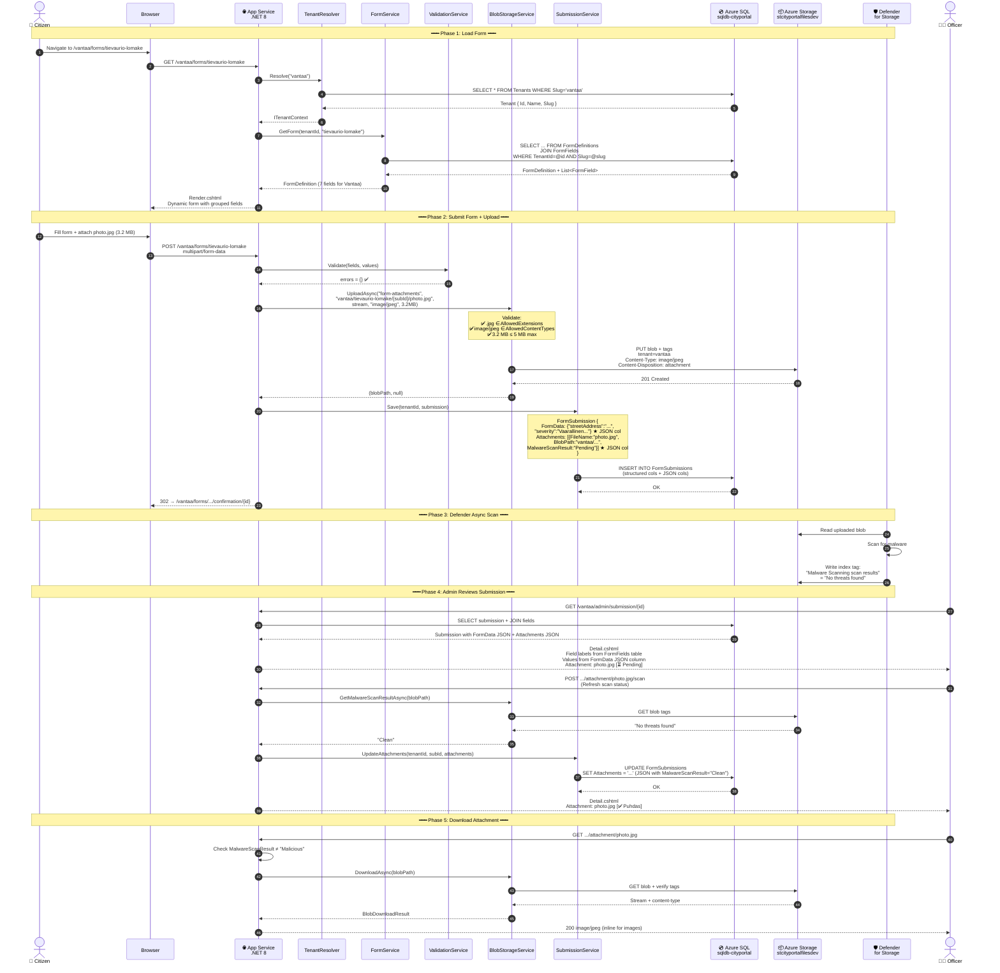
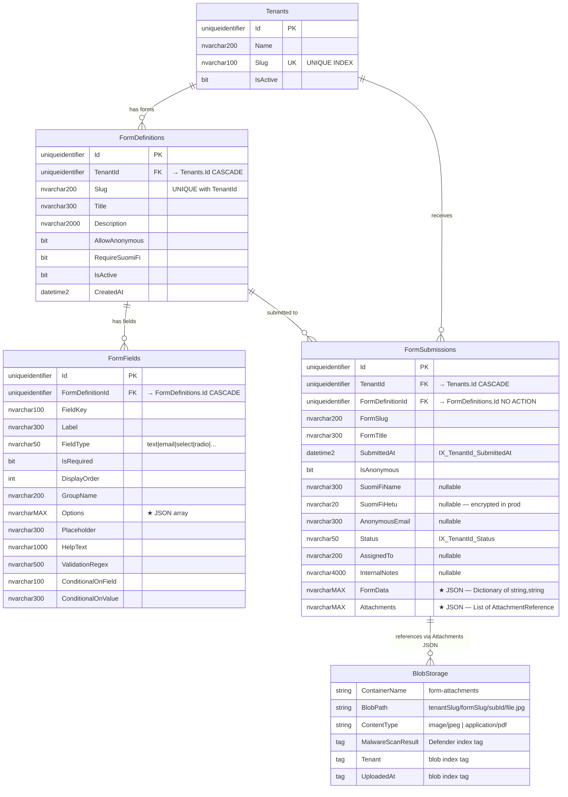

```mermaid
%%─────────────────────────────────────────────────────────────────────────────
%%  CityPortal — Request Flow: Form Submission with Attachment
%%─────────────────────────────────────────────────────────────────────────────

sequenceDiagram
    autonumber
    actor User as 👤 Citizen
    participant Browser
    participant App as 🌐 App Service<br/>.NET 8
    participant TenantRes as TenantResolver
    participant FormSvc as FormService
    participant Validator as ValidationService
    participant BlobSvc as BlobStorageService
    participant SubSvc as SubmissionService
    participant SQL as 💿 Azure SQL<br/>sqldb-cityportal
    participant Blob as 📦 Azure Storage<br/>stcityportalfilesdev
    participant Defender as 🛡️ Defender<br/>for Storage

    Note over User,Defender: ━━━ Phase 1: Load Form ━━━

    User->>Browser: Navigate to /vantaa/forms/tievaurio-lomake
    Browser->>App: GET /vantaa/forms/tievaurio-lomake
    App->>TenantRes: Resolve("vantaa")
    TenantRes->>SQL: SELECT * FROM Tenants WHERE Slug='vantaa'
    SQL-->>TenantRes: Tenant { Id, Name, Slug }
    TenantRes-->>App: ITenantContext

    App->>FormSvc: GetForm(tenantId, "tievaurio-lomake")
    FormSvc->>SQL: SELECT ... FROM FormDefinitions<br/>JOIN FormFields<br/>WHERE TenantId=@id AND Slug=@slug
    SQL-->>FormSvc: FormDefinition + List<FormField>
    FormSvc-->>App: FormDefinition (7 fields for Vantaa)

    App-->>Browser: Render.cshtml<br/>Dynamic form with grouped fields

    Note over User,Defender: ━━━ Phase 2: Submit Form + Upload ━━━

    User->>Browser: Fill form + attach photo.jpg (3.2 MB)
    Browser->>App: POST /vantaa/forms/tievaurio-lomake<br/>multipart/form-data

    App->>Validator: Validate(fields, values)
    Validator-->>App: errors = {} ✅

    App->>BlobSvc: UploadAsync("form-attachments",<br/>"vantaa/tievaurio-lomake/{subId}/photo.jpg",<br/>stream, "image/jpeg", 3.2MB)

    Note over BlobSvc: Validate:<br/>✅ .jpg ∈ AllowedExtensions<br/>✅ image/jpeg ∈ AllowedContentTypes<br/>✅ 3.2 MB ≤ 5 MB max

    BlobSvc->>Blob: PUT blob + tags<br/>tenant=vantaa<br/>Content-Type: image/jpeg<br/>Content-Disposition: attachment
    Blob-->>BlobSvc: 201 Created
    BlobSvc-->>App: (blobPath, null)

    App->>SubSvc: Save(tenantId, submission)
    Note over SubSvc: FormSubmission {<br/>  FormData: {"streetAddress":"...",<br/>    "severity":"Vaarallinen..."} ★ JSON col<br/>  Attachments: [{FileName:"photo.jpg",<br/>    BlobPath:"vantaa/...",<br/>    MalwareScanResult:"Pending"}] ★ JSON col<br/>}
    SubSvc->>SQL: INSERT INTO FormSubmissions<br/>(structured cols + JSON cols)
    SQL-->>SubSvc: OK

    App-->>Browser: 302 → /vantaa/forms/.../confirmation/{id}

    Note over User,Defender: ━━━ Phase 3: Defender Async Scan ━━━

    Defender->>Blob: Read uploaded blob
    Defender->>Defender: Scan for malware
    Defender->>Blob: Write index tag:<br/>"Malware Scanning scan results"<br/>= "No threats found"

    Note over User,Defender: ━━━ Phase 4: Admin Reviews Submission ━━━

    actor Admin as 👩‍💼 Officer
    Admin->>App: GET /vantaa/admin/submission/{id}
    App->>SQL: SELECT submission + JOIN fields
    SQL-->>App: Submission with FormData JSON + Attachments JSON

    App-->>Admin: Detail.cshtml<br/>Field labels from FormFields table<br/>Values from FormData JSON column<br/>Attachment: photo.jpg [⏳ Pending]

    Admin->>App: POST .../attachment/photo.jpg/scan<br/>(Refresh scan status)
    App->>BlobSvc: GetMalwareScanResultAsync(blobPath)
    BlobSvc->>Blob: GET blob tags
    Blob-->>BlobSvc: "No threats found"
    BlobSvc-->>App: "Clean"

    App->>SubSvc: UpdateAttachments(tenantId, subId, attachments)
    SubSvc->>SQL: UPDATE FormSubmissions<br/>SET Attachments = '...' (JSON with MalwareScanResult="Clean")
    SQL-->>SubSvc: OK

    App-->>Admin: Detail.cshtml<br/>Attachment: photo.jpg [✅ Puhdas]

    Note over User,Defender: ━━━ Phase 5: Download Attachment ━━━

    Admin->>App: GET .../attachment/photo.jpg
    App->>App: Check MalwareScanResult ≠ "Malicious"
    App->>BlobSvc: DownloadAsync(blobPath)
    BlobSvc->>Blob: GET blob + verify tags
    Blob-->>BlobSvc: Stream + content-type
    BlobSvc-->>App: BlobDownloadResult
    App-->>Admin: 200 image/jpeg (inline for images)
```

---

```mermaid
%%─────────────────────────────────────────────────────────────────────────────
%%  CityPortal — Data Model: Structured vs Semi-structured
%%─────────────────────────────────────────────────────────────────────────────

erDiagram
    Tenants {
        uniqueidentifier Id PK
        nvarchar200 Name
        nvarchar100 Slug UK "UNIQUE INDEX"
        bit IsActive
    }

    FormDefinitions {
        uniqueidentifier Id PK
        uniqueidentifier TenantId FK "→ Tenants.Id CASCADE"
        nvarchar200 Slug "UNIQUE with TenantId"
        nvarchar300 Title
        nvarchar2000 Description
        bit AllowAnonymous
        bit RequireSuomiFi
        bit IsActive
        datetime2 CreatedAt
    }

    FormFields {
        uniqueidentifier Id PK
        uniqueidentifier FormDefinitionId FK "→ FormDefinitions.Id CASCADE"
        nvarchar100 FieldKey
        nvarchar300 Label
        nvarchar50 FieldType "text|email|select|radio|..."
        bit IsRequired
        int DisplayOrder
        nvarchar200 GroupName
        nvarcharMAX Options "★ JSON array"
        nvarchar300 Placeholder
        nvarchar1000 HelpText
        nvarchar500 ValidationRegex
        nvarchar100 ConditionalOnField
        nvarchar300 ConditionalOnValue
    }

    FormSubmissions {
        uniqueidentifier Id PK
        uniqueidentifier TenantId FK "→ Tenants.Id CASCADE"
        uniqueidentifier FormDefinitionId FK "→ FormDefinitions.Id NO ACTION"
        nvarchar200 FormSlug
        nvarchar300 FormTitle
        datetime2 SubmittedAt "IX_TenantId_SubmittedAt"
        bit IsAnonymous
        nvarchar300 SuomiFiName "nullable"
        nvarchar20 SuomiFiHetu "nullable — encrypted in prod"
        nvarchar300 AnonymousEmail "nullable"
        nvarchar50 Status "IX_TenantId_Status"
        nvarchar200 AssignedTo "nullable"
        nvarchar4000 InternalNotes "nullable"
        nvarcharMAX FormData "★ JSON — Dictionary of string,string"
        nvarcharMAX Attachments "★ JSON — List of AttachmentReference"
    }

    Tenants ||--o{ FormDefinitions : "has forms"
    FormDefinitions ||--o{ FormFields : "has fields"
    Tenants ||--o{ FormSubmissions : "receives"
    FormDefinitions ||--o{ FormSubmissions : "submitted to"

    FormSubmissions ||--o{ BlobStorage : "references via Attachments JSON"

    BlobStorage {
        string ContainerName "form-attachments"
        string BlobPath "tenantSlug/formSlug/subId/file.jpg"
        string ContentType "image/jpeg | application/pdf"
        tag MalwareScanResult "Defender index tag"
        tag Tenant "blob index tag"
        tag UploadedAt "blob index tag"
    }
```
